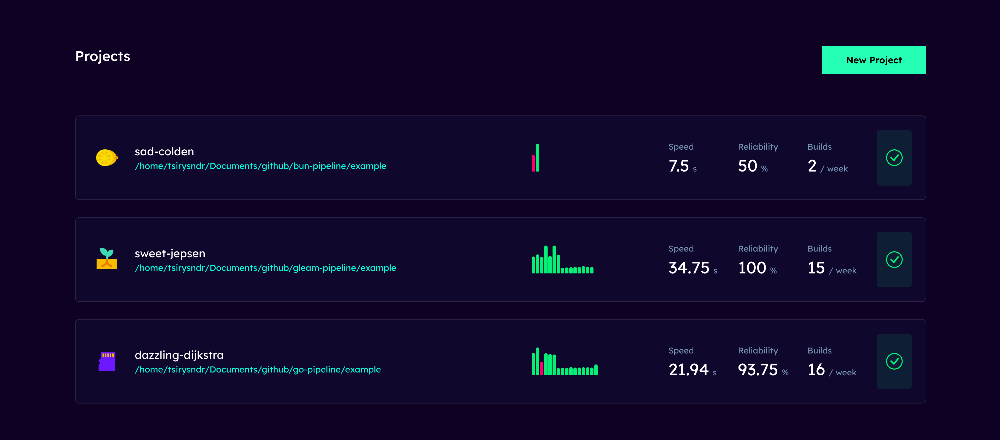

# FluentCI Studio

FluentCI Studio is a new way for you to explore CI pipelines on FluentCI projects.

## Usage

Run the following command to start the FluentCI Studio:

```bash
fluentci studio
```

## Building

Run the following command to build the FluentCI Studio:

```bash
cd webui && bun install && bun run build && cd ..
cargo build --release
```
